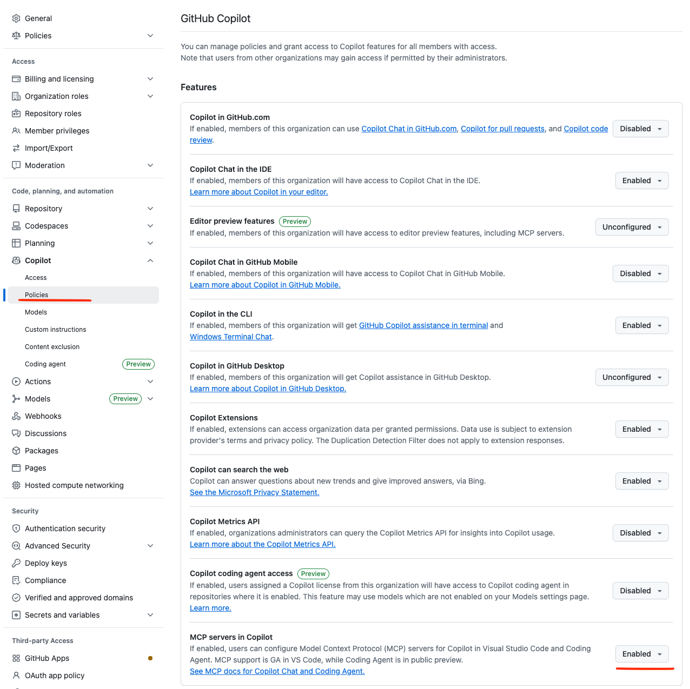

# AppSignal MCP Server

This is the official [AppSignal](https://www.appsignal.com/tour/mcp-server) [MCP][mcp] server. Everything necessary to debug using AppSignal's monitoring data, metrics, and tools is now accessible from your favorite AI editor. 


This feature is in *Beta*. Documentation can also be found [here](https://docs.appsignal.com/mcp) 

Join our [Discord community][discord] to help shape this MCP implementation. Feature requests are welcome! 

## Prerequisites

- Docker
- An [AppSignal account][appsignal-sign-up] and an [AppSignal MCP token][appsignal-mcp-token].

## Installation

Pull the Docker image:

```
docker pull appsignal/mcp:latest
```

## Configuration

### Claude

Configure Claude to use the AppSignal MCP server by editing the `~/Library/Application Support/Claude/claude_desktop_config.json` file:

```json
{
  "mcpServers": {
    "appsignal": {
      "command": "docker",
      "args": ["run", "-i", "--rm", "-e", "APPSIGNAL_API_KEY", "appsignal/mcp"],
      "env": {
        "APPSIGNAL_API_KEY": "your_api_key_here"
      }
    }
  }
}
```

You can find this by navigating to your Profile -> Settings -> Developer and then clicking `Edit Config`


### Claude Code

To enable AppSignal MCP in Claude Code, run the following command:

```
claude mcp add appsignal -e APPSIGNAL_API_KEY=your_api_key_here -- docker run -i --rm -e APPSIGNAL_API_KEY appsignal/mcp
```

### Cursor and Windsurf

To enable AppSignal MCP in Cursor or Windsurf, edit your configuration file.

For Cursor use `~/.cursor/mcp.json`

For Windsurf use `~/.codeium/windsurf/mcp_config.json`

Add the following configuration:

```json
{
  "mcpServers": {
    "appsignal": {
      "command": "docker",
      "args": ["run", "-i", "--rm", "-e", "APPSIGNAL_API_KEY", "appsignal/mcp"],
      "env": {
        "APPSIGNAL_API_KEY": "your-mcp-token"
      }
    }
  }
}
```

### Zed

Open your Zed settings file and add the `context_servers` section:

```json
{
  "context_servers": {
    "appsignal": {
      "source": "custom",
      "command": "docker",
      "args": ["run", "-i", "--rm", "-e", "APPSIGNAL_API_KEY", "appsignal/mcp"],
      "env": {
        "APPSIGNAL_API_KEY": "your-mcp-token"
      }
    }
}
```

### VSCode

If you are running GitHub Copilot, and are signed in under a company account, make sure to set "MCP servers in Copilot" to "Enabled" under your organization settings > Copilot > Policies.



Then add this config to your `.vscode/mcp.json` settings:

```json
{
  "inputs": [
    {
      "type": "promptString",
      "id": "appsignal_mcp_token",
      "description": "AppSignal MCP Token",
      "password": true
    }
  ],
  "servers": {
    "appsignal": {
      "command":  "docker"
      "args": [
        "run",
        "-i",
        "--rm",
        "-e",
        "APPSIGNAL_API_KEY",
        "appsignal/mcp"
      ],
      "env": {
        "APPSIGNAL_API_KEY": "${input:appsignal_mcp_token}"
      }
    }
  }
}
```

## Development

To work on the MCP server:

1. Start the TypeScript compiler in watch mode:

   ```bash
   npm run watch
   ```

2. Run tests:

   ```bash
   npm test
   ```

3. Use the MCP inspector for debugging:
   ```bash
   npm run inspector
   ```

### Change management

Every change that will results in a new version to be released, requires a changeset.
Changesets are small Markdown file that describe the change for the end-user.
The changeset's frontmatter describes the type of change (new feature, bug fix, etc.) and the version bump (major, minor, or patch).

Use [Mono's changeset CLI](https://github.com/appsignal/mono/?tab=readme-ov-file#changeset-add) to generate a new changeset file.
Commit the changeset file and include it in your Pull Requests.

```
mono changeset add
```

### Publishing

Install [Mono](https://github.com/appsignal/mono/), the tool used for release management.

```
git pull # Ensure you have the latest version

mono publish # Publish a new version
```

## Contributing

Thinking of contributing to our project? Awesome! 🚀

Please follow our [Contributing guide][contributing-guide] in our
documentation and follow our [Code of Conduct][coc].

Also, we would be very happy to send you Stroopwafles. Have look at everyone
we send a package to so far on our [Stroopwafles page][waffles-page].

## Support

- Join our [Discord community][discord] to chat with other developers and the AppSignal team
- [Contact us][contact] to speak directly with the engineers working on AppSignal. They will help you get set up, tweak your code and make sure you get the most out of using AppSignal.

## License

This project is licensed under the MIT License - see the [LICENSE](LICENSE) file for details.

## About AppSignal

[AppSignal][appsignal] provides real-time performance monitoring for your web applications. Track errors, monitor performance, measure client-side metrics, and receive alerts when things go wrong.

[mcp]: https://github.com/anthropics/anthropic-tools/blob/main/model-context-protocol.md
[appsignal]: https://www.appsignal.com
[appsignal-sign-up]: https://appsignal.com/users/sign_up
[appsignal-mcp-token]: https://appsignal.com/users/mcp_tokens
[contact]: mailto:support@appsignal.com
[coc]: https://docs.appsignal.com/appsignal/code-of-conduct.html
[waffles-page]: https://www.appsignal.com/waffles
[contributing-guide]: https://docs.appsignal.com/appsignal/contributing.html
[discord]: https://discord.gg/fT2cbMuQSJ
