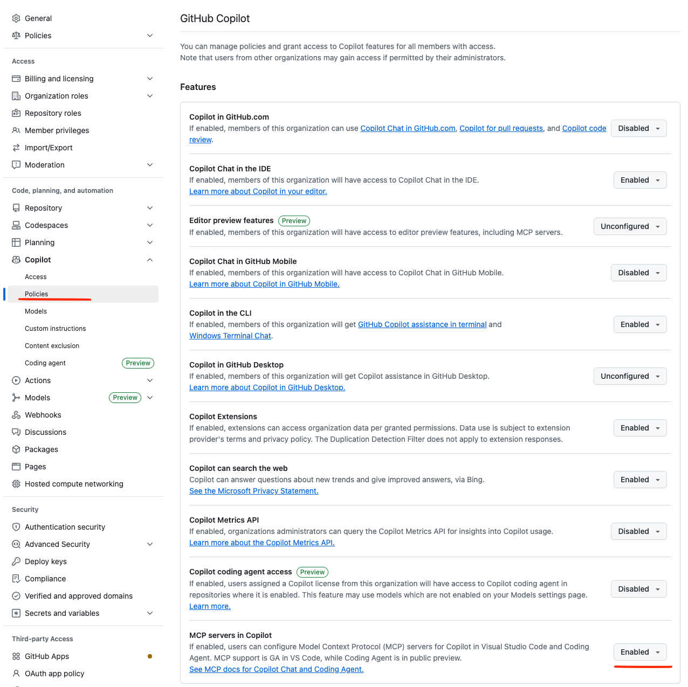

# AppSignal MCP Server

This is the official [AppSignal](https://www.appsignal.com/tour/mcp-server) [MCP][mcp] server. Everything necessary to debug using AppSignal's monitoring data, metrics, and tools is now accessible from your favorite AI editor.


AppSignal MCP is a public HTTP endpoint at `https://appsignal.com/api/mcp`. Most agents connect to it directly — **you don't need this repository to use AppSignal MCP**. It holds the optional Docker image that proxies the endpoint over stdio, for environments that restrict outbound traffic or agents that can't speak HTTP MCP.

This feature is in *preview*. Read the full MCP reference on [AppSignal official documentation](https://docs.appsignal.com/mcp-server).

Join our [Discord community][discord] to help shape this MCP implementation. Feature requests are welcome!

## Prerequisites

- Docker
- An [AppSignal account][appsignal-sign-up] and an [AppSignal MCP token][appsignal-mcp-token].

## Installation

Pull the Docker image:

```
docker pull appsignal/mcp:latest
```

The image reads two environment variables: `APPSIGNAL_API_KEY` (required, your MCP token) and `APPSIGNAL_ENDPOINT` (optional, defaults to `https://appsignal.com/api/mcp`).

## Configuration

Each editor below shows two options: the HTTP endpoint, which authenticates with OAuth, and the Docker image, which authenticates with your [MCP token][appsignal-mcp-token]. To use a token over HTTP instead of OAuth, add an `Authorization: Bearer <YOUR_MCP_TOKEN>` header — see the [setup guide][docs-setup] for the exact form per editor.

### Claude Code

```bash
claude mcp add --transport http appsignal https://appsignal.com/api/mcp
```

Claude Code starts the browser sign-in the first time an AppSignal tool is used. Run `claude mcp list` to confirm it shows as connected.

With Docker:

```bash
claude mcp add appsignal -e APPSIGNAL_API_KEY=your-mcp-token -- docker run -i --rm -e APPSIGNAL_API_KEY appsignal/mcp
```

### Claude app

Claude.ai, and the desktop and mobile apps, connect over OAuth as a custom connector. There's no Bearer token option here.

1. Open **Settings**, then **Connectors**.
2. Select **Browse**, search for `appsignal`, and open the AppSignal connector. If it isn't listed, select **Add custom connector** and enter `https://appsignal.com/api/mcp`.
3. Select **Connect** and complete the AppSignal sign-in.

To run the Docker proxy locally instead, open **Settings → Developer → Local MCP servers** and select **Edit Config**.


Then add this configuration to the file that opens:

```json
{
  "mcpServers": {
    "appsignal": {
      "command": "docker",
      "args": ["run", "-i", "--rm", "-e", "APPSIGNAL_API_KEY", "appsignal/mcp"],
      "env": {
        "APPSIGNAL_API_KEY": "your-mcp-token"
      }
    }
  }
}
```

### Cursor and Windsurf

To enable AppSignal MCP in Cursor or Windsurf, edit your configuration file.

For Cursor use `~/.cursor/mcp.json`

For Windsurf use `~/.codeium/windsurf/mcp_config.json`

Add the following configuration:

```json
{
  "mcpServers": {
    "appsignal": {
      "command": "docker",
      "args": ["run", "-i", "--rm", "-e", "APPSIGNAL_API_KEY", "appsignal/mcp"],
      "env": {
        "APPSIGNAL_API_KEY": "your-mcp-token"
      }
    }
  }
}
```

### Zed

Open your Zed settings file and add the `context_servers` section:

```json
{
  "context_servers": {
    "appsignal": {
      "source": "custom",
      "command": "docker",
      "args": ["run", "-i", "--rm", "-e", "APPSIGNAL_API_KEY", "appsignal/mcp"],
      "env": {
        "APPSIGNAL_API_KEY": "your-mcp-token"
      }
    }
  }
}
```

### VS Code

If you use GitHub Copilot under a company account, set **MCP servers in Copilot** to **Enabled** in your organization settings (Settings → Copilot → Policies → Features).



Then add this config to your `.vscode/mcp.json` settings:

```json
{
  "inputs": [
    {
      "type": "promptString",
      "id": "appsignal_mcp_token",
      "description": "AppSignal MCP Token",
      "password": true
    }
  ],
  "servers": {
    "appsignal": {
      "command": "docker",
      "args": [
        "run",
        "-i",
        "--rm",
        "-e",
        "APPSIGNAL_API_KEY",
        "appsignal/mcp"
      ],
      "env": {
        "APPSIGNAL_API_KEY": "${input:appsignal_mcp_token}"
      }
    }
  }
}
```

### Other agents

GitHub Copilot CLI, Gemini CLI, and OpenAI Codex are covered in the [setup guide][docs-setup].

## What you can access

The endpoint exposes read and write tools across seven areas: error incidents, performance, anomaly detection, logging, metrics, dashboards, and app discovery. With an MCP token, each area can be set to `read`, `write`, or disabled. With OAuth, all read and write tools are exposed at once.

For the full list of tools, parameters, and example prompts, see the [MCP tool reference][docs-reference].

## Development

To work on the MCP server:

1. Start the TypeScript compiler in watch mode:

   ```bash
   npm run watch
   ```

2. Run tests:

   ```bash
   npm test
   ```

3. Use the MCP inspector for debugging:
   ```bash
   npm run inspector
   ```

### Change management

Every change that will results in a new version to be released, requires a changeset.
Changesets are small Markdown file that describe the change for the end-user.
The changeset's frontmatter describes the type of change (new feature, bug fix, etc.) and the version bump (major, minor, or patch).

Use [Mono's changeset CLI](https://github.com/appsignal/mono/?tab=readme-ov-file#changeset-add) to generate a new changeset file.
Commit the changeset file and include it in your Pull Requests.

```
mono changeset add
```

### Publishing

Install [Mono](https://github.com/appsignal/mono/), the tool used for release management.

```
git pull # Ensure you have the latest version

mono publish # Publish a new version
```

## Contributing

Thinking of contributing to our project? Awesome! 🚀

Please follow our [Contributing guide][contributing-guide] in our
documentation and follow our [Code of Conduct][coc].

Also, we would be very happy to send you Stroopwafles. Have look at everyone
we send a package to so far on our [Stroopwafles page][waffles-page].

## Support

- Join our [Discord community][discord] to chat with other developers and the AppSignal team
- [Contact us][contact] to speak directly with the engineers working on AppSignal. They will help you get set up, tweak your code and make sure you get the most out of using AppSignal.

## License

This project is licensed under the MIT License - see the [LICENSE](LICENSE) file for details.

## About AppSignal

[AppSignal][appsignal] provides real-time performance monitoring for your web applications. Track errors, monitor performance, measure client-side metrics, and receive alerts when things go wrong.

[mcp]: https://modelcontextprotocol.io/introduction
[docs-setup]: https://docs.appsignal.com/mcp/setup
[docs-reference]: https://docs.appsignal.com/mcp/reference
[appsignal]: https://www.appsignal.com
[appsignal-sign-up]: https://appsignal.com/users/sign_up
[appsignal-mcp-token]: https://appsignal.com/users/mcp_tokens
[contact]: mailto:support@appsignal.com
[coc]: https://docs.appsignal.com/appsignal/contributing/code-of-conduct
[waffles-page]: https://www.appsignal.com/waffles
[contributing-guide]: https://docs.appsignal.com/appsignal/contributing
[discord]: https://discord.gg/fT2cbMuQSJ
